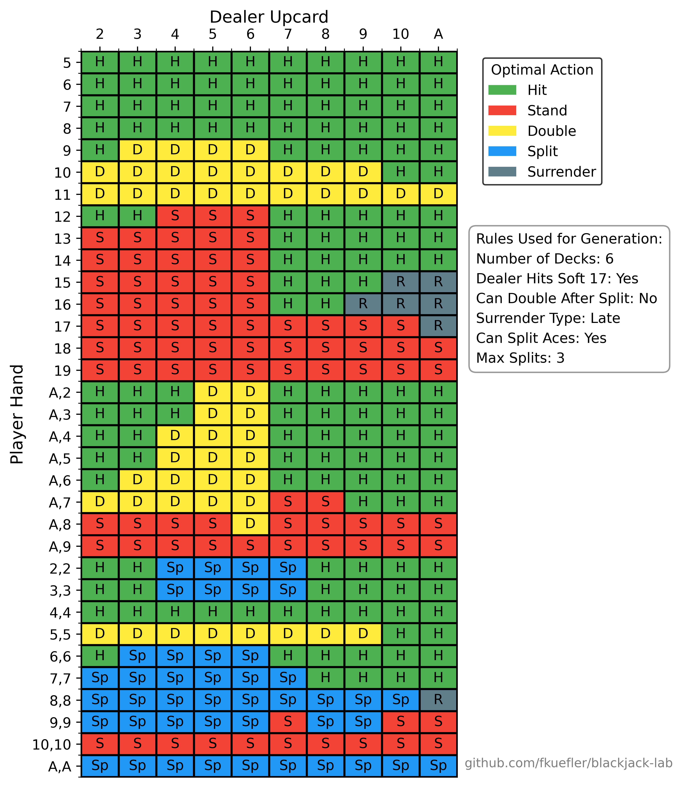

# Blackjack Lab
A Blackjack **Expected Value Calculator** and **Custom Chart Generator**. Unlike other blackjack EV calculators that use simulation-based approaches (e.g., Monte Carlo) to estimate EV, this calculator performs an exact computation by traversing the entire probability tree. This guarantees that outputs are fully reproducible and mathematically precise.

# Installation
Select the latest release and download the version for your OS. Unzip the downloaded folder and open it in your terminal.

# Usage
To see available functions, run:
```bash
./BlackjackLab help
```
To see details on how to use a function, run:
```bash
./BlackjackLab <function> --help
```
## EV calculation
To calculate the EV of each action for a specific player hand vs specific dealer hand, run:
```bash
./BlackjackLab ev-calc --player-cards <cards> --dealer-upcard <card>
```

You can add custom parameters, or leave blank to use defaults:
```bash
# EV of player 16 vs dealer 8 in single deck blackjack with no double after splits where dealer hits soft 17
# The rest of the game rules (run './BlackjackLab ev-calc --help' to see) are defaulted.
./BlackjackLab ev-calc --player-cards 10,6 --dealer-upcard 8 --decks 1 --das false --s17 false
```

Example output from the command above:
```
Calculating EV for optimal strategy...
Hit EV: -0.424823
Stand EV: -0.527007
Split EV: nan
Double EV: -0.849645
Surrender EV: -0.5

Optimal Action: Hit
Optimal EV: -0.424823
```

## Strategy Chart Generation
To generate a custom strategy chart for any combination of game rules, run:
```bash
./BlackjackLab strategy
```

To see defaults and other info, run:
```bash
./BlackjackLab strategy --help
```

Add custom game rules or use defaults:
```bash
# Generate a strategy chart for 6 deck blackjack with no double after split
./BlackjackLab strategy --decks 6 --das false
```

The results will be written to a csv file (strategy.csv by default, but can be changed by adding '--output <filename.csv>' to the command).

To turn the csv file into a strategy chart, first make sure python is installed with matplotlib and pandas. Then, in the same folder as before, run:
```bash
python chart_generator.py <filename.csv>
```

Add the '--save <filename.png>' flag to the command to save the chart with a custom name.

Example chart generated using command above:



# License

This project is licensed under **CC BY-NC 4.0**.  
You may use, share, and adapt it for non-commercial purposes, with attribution.

See [LICENSE.md](LICENSE.md) or [CC BY-NC 4.0](https://creativecommons.org/licenses/by-nc/4.0/) for full details.

# Contact
Suggestions and improvement requests are welcome!

For bugs, suggestions, or improvements, please open an [issue](https://github.com/fkuefler/blackjack-lab/issues) on GitHub.  
